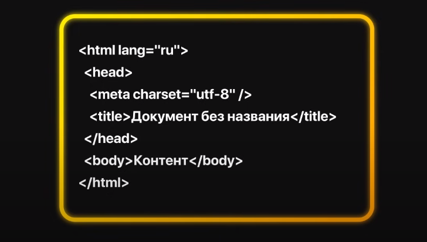
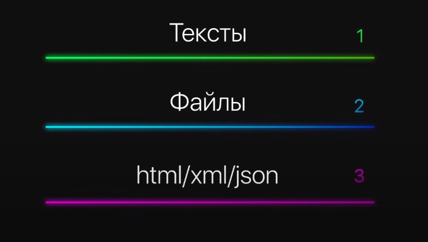
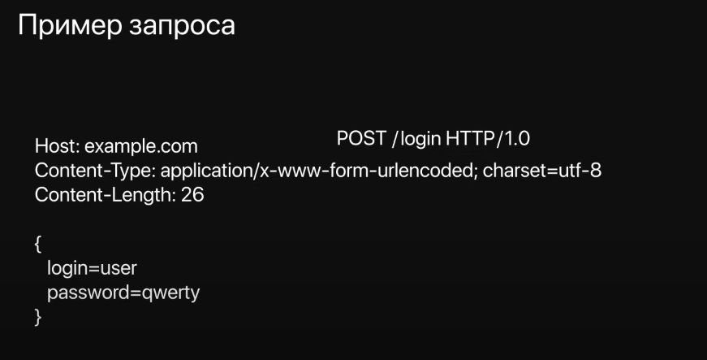
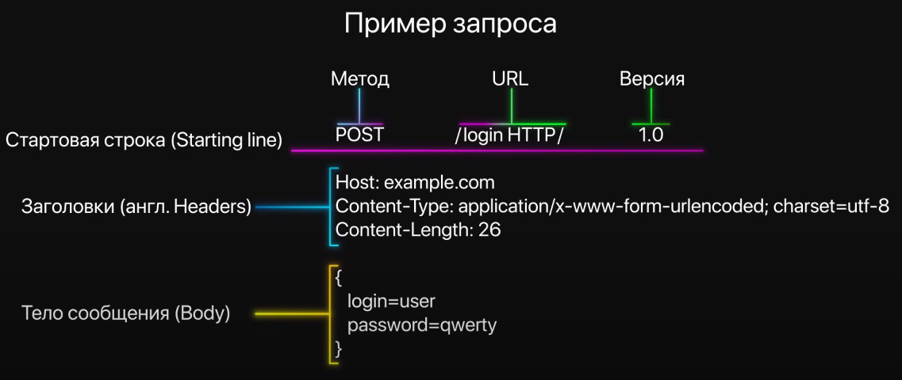

Alpha Vantage BBB4DAOMC7P538MQ

# Введение

## Клиент-сервер. HTTP. REST API. SOAP

---

## Клиент-сервер


---

## Клиент-сервер


---

## Клиент-сервер


---

## Клиент-сервер


---

## Клиент-сервер


---

## HTTP

Протоколы | Уровень
--- | ---
HTTP, DNS, DHCP, FTP | Уровень приложений
TCP, UDP | Транспортный уровень
IPv4, IPv6, ICMPv4, ICMPv6 | Межсетевой уровень
PPP, Frame Relay, Ethernet | Уровень сетевого доступа

---

## HTTP
<!--  -->
```html
<html lang="ru">
    <head>
        <meta charset="utf-8" />
        <title>Документ без названия<title>
    </head>
    <body>Контент</body>
</html>
```

---

## HTTP

<!--  -->
### 1. Тексты
### 2. Файлы
### 3. html/xml/json

---

## HTTP

<!--  -->
Пример запроса:
```http
POST /login HTTP/1.0
Host: example.com
Content-Type: application/x-www-form-urlencoded; charset=utf-8
Content-Length: 26
{
    login=use
    password=qwerty
}
```

---

## HTTP

<!--  -->

Пример запроса:

<table>
<tr>
<td>
Стартовая строка (Starting line)
</td>
<td>

```http
POST /login HTTP/1.0
```
</td>
</tr>
<tr>
<td>
Заголовки (Headers)
</td>
<td>

```http
Host: example.com
Content-Type: application/x-www-form-urlencoded; charset=utf-8
Content-Length: 26
```
</td>
</tr>
<tr>
<td>
Тело сообщения (Body)
</td>
<td>

```http
{
 login=use
 password=qwerty
}
```
</td>
</tr>
<table>
