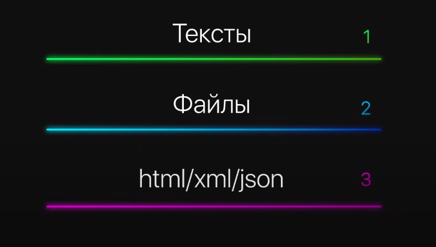
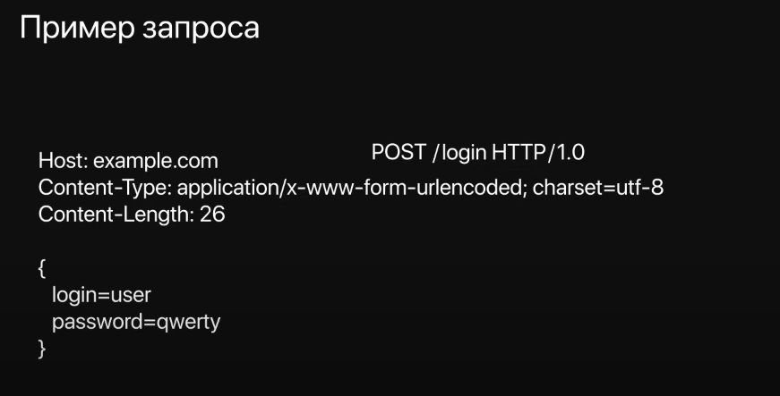
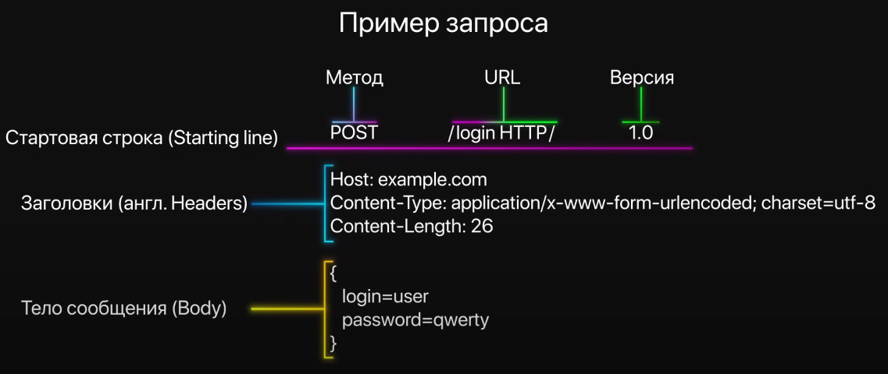
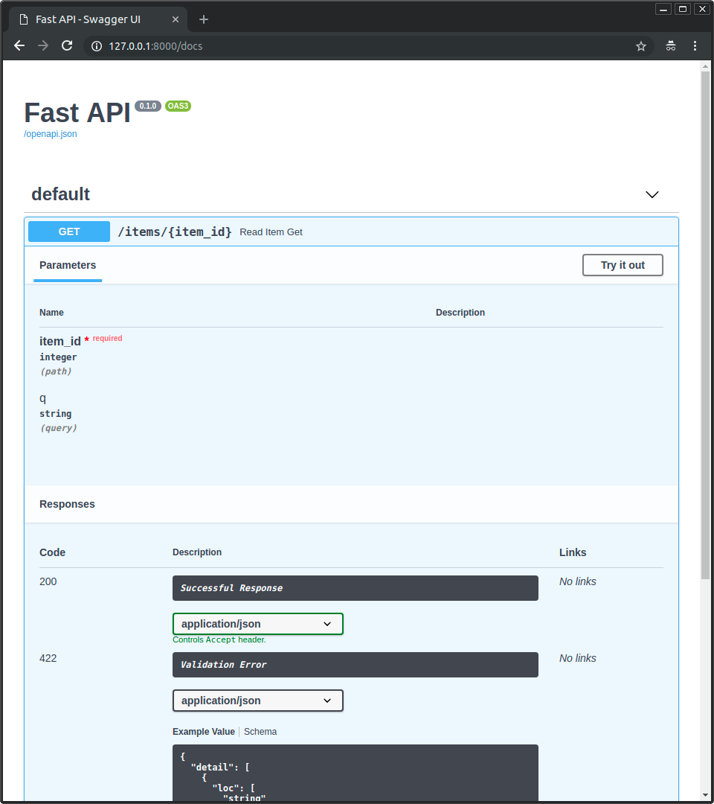

<!-- Alpha Vantage BBB4DAOMC7P538MQ -->

<!-- _class: title -->
<div class="title">

# Введение

</div>

<div class="subtitle">
Клиент-сервер. HTTP. REST API. SOAP. FastAPI.
</div>

---

## Содержание курса

1. API, requests
2. FastAPI
3. FastAPI + Postgres
4. FastAPI + Jinja
5. Web-приложение на основе FastAPI + Postgres + Jinja

---

## Критерии оценивания

Курс будет оцениваться по балльно-рейтинговой системе. **Максимальный балл за курс: 100.**
Балл будет складываться из следующих частей:
1. Посещаемость - **10 баллов**;
2. Практические работы - **30 баллов**;
3. Зачет - **60 баллов**.
Отметка зачтено выставляется от **50 баллов**.

---

## Клиент-сервер


---

## Клиент-сервер


---

## Клиент-сервер


---

## Клиент-сервер


---

## Клиент-сервер


---

## HTTP
**HTTP — Hyper Text Transfer Protocol**

<div>

Протоколы | Уровень
--- | ---
HTTP, DNS, DHCP, FTP | Уровень приложений
TCP, UDP | Транспортный уровень
IPv4, IPv6, ICMPv4, ICMPv6 | Межсетевой уровень
PPP, Frame Relay, Ethernet | Уровень сетевого доступа

</div>

---

## HTTP
<!--  -->


```html
<html lang="ru">
    <head>
        <meta charset="utf-8" />
        <title>Документ без названия<title>
    </head>
    <body>Контент</body>
</html>
```

<!--  -->
Изначально - только для гипертекста
Сейчас так же доступны:
1. Тексты
2. Файлы
3. html/xml/json

---

## HTTP

<!--  -->
Пример запроса:
```http
POST /login HTTP/1.0
Host: example.com
Content-Type: application/x-www-form-urlencoded; charset=utf-8
Content-Length: 26
{
    login=use
    password=qwerty
}
```

---

## HTTP

<!--  -->

Пример запроса:

<div>
<table>
<tr>
<td>
Стартовая строка (Starting line)
</td>
<td>

```http
POST /login HTTP/1.0
```
</td>
</tr>
<tr>
<td>
Заголовки (Headers)
</td>
<td style="height:200px; width:70%">

```http
Host: example.com
Content-Type: application/x-www-form-urlencoded; charset=utf-8
Content-Length: 26
```
</td>
</tr>
<tr>
<td>
Тело сообщения (Body)
</td>
<td>

```http
{
 login=use
 password=qwerty
}
```

</td>
</tr>
</table>

---

## HTTP

Стартовая строка (Starting line) состоит из: 
1. Метода: ```POST```
2. URL: ```/login```
3. Версии: ```HTTP/1.0```

Основные методы:
* **GET** - получение ресурса
* **POST** - передача данных (создание ресурса)
* **PUT** - обновление ресурса
* **PATCH** - обновление фрагмента ресурса (частичное)
* **DELETE** - удаление ресурса

<!--  -->

---

<!--_class: columns-->

## HTTP

<div>

Строка статуса (status line): `HTTP/1.1 200 OK`
Статус коды:
* **1xx**: Informational
* **2xx**: Success
* **3xx**: Redirection
* **4xx**: Client Error
* **5xx**: Server Error
</div>
<div>

Примеры:
* **404** - не найдено
* **400** - не корректный запрос
* **200** - ОК
* **201** - ОК (создано)
* **500** - внутрення ошибка сервера
</div>

<!--  -->

---

## API

**Интерфейс прикладного программирования (Application Programming Interface, API)** определяет правила, которым необходимо следовать для связи с другими программными системами. Разработчики внедряют или создают API-интерфейсы, чтобы другие приложения могли программно взаимодействовать с их приложениями. Например, приложение с табелем рабочего времени содержит API, который запрашивает полное имя сотрудника и диапазон дат. Получив эту информацию, интерфейс внутренне обрабатывает табель рабочего времени сотрудника и возвращает количество часов, отработанных за указанный период.

Таким образом, сетевой API функционирует как шлюз между клиентами и ресурсами в Интернете.

---

## API

### Клиенты
Клиенты — это пользователи, которые хотят получить доступ к информации в Интернете. Клиентом может быть человек или программная система, использующая API. Например, разработчики могут создавать программы, которые получают доступ к данным о погоде из метеосистемы. Также получить доступ к этим данным можно из браузера, посетив веб-сайт с информацией о погоде.

### Ресурсы
Ресурсы — это информация, которую различные приложения предоставляют своим клиентам. Ресурсы могут быть изображениями, видео, текстом, числами или данными любого типа. Компьютер, который предоставляет ресурсы клиенту, также называется сервером. API позволяет организациям совместно использовать ресурсы и предоставляет веб-службы, обеспечивая безопасность, контроль и аутентификацию. Кроме того, API помогает определить, какие клиенты могут получить доступ к определенным внутренним ресурсам.

---

## REST API

**REST** расшифровывается как REpresentational State Transfer. Этот термин, первоначально введен Роем Филдингом (Roy Fielding), который также был одним из создателей протокола HTTP. Отличительной особенностью сервисов REST является то, что они позволяют наилучшим образом использовать протокол HTTP. 

**Representational State Transfer (REST)** — это программная архитектура, которая определяет условия работы API. Первоначально REST создавалась как руководство для управления взаимодействиями в сложной сети, такой как Интернет. Архитектуру на основе REST можно использовать для поддержки высокопроизводительной и надежной связи в требуемом масштабе. Ее можно легко внедрять и модифицировать, обеспечивая прозрачность и кросс-платформенную переносимость любой системы API.

---

## REST API. Принципы архитектурного стиля

### Единый интерфейс
Единый интерфейс является конструктивной основой любого веб-сервиса RESTful. Это указывает на то, что сервер передает информацию в стандартном формате. Отформатированный ресурс в REST называется представлением. Этот формат может отличаться от внутреннего представления ресурса в серверном приложении. Например, сервер может хранить данные в виде текста, но отправлять их в формате представления HTML.

---

## REST API. Принципы архитектурного стиля


Единый интерфейс накладывает четыре архитектурных ограничения:

1. Запросы должны идентифицировать ресурсы. Это происходит за счет единого идентификатора ресурсов.
2. Клиенты имеют достаточно информации в представлении ресурса, чтобы при желании изменить или удалить ресурс. Сервер выполняет это условие, отправляя метаданные, которые дополнительно описывают ресурс.
3. Клиенты получают информацию о дальнейшей обработке представлений. Сервер реализует это, отправляя описательные сообщения, где содержатся метаданные о том, как клиент может использовать их оптимальным образом.
4. Клиенты получают информацию обо всех связанных ресурсах, необходимых для выполнения задачи. Сервер реализует это, отправляя гиперссылки в представлении, чтобы клиенты могли динамически обнаруживать больше ресурсов.

---

## REST API. Принципы архитектурного стиля

### Отсутствие сохранения состояния
В архитектуре REST отсутствие сохранения состояния относится к методу связи, при котором сервер выполняет каждый клиентский запрос независимо от всех предыдущих запросов. Клиенты могут запрашивать ресурсы в любом порядке, и каждый запрос либо изолирован от других запросов, либо его состояние не сохраняется. Это конструктивное ограничение REST API подразумевает, что сервер может каждый раз полностью понять и выполнить запрос. 

### Многоуровневая система
В многоуровневой системной архитектуре клиент может подключаться к другим авторизованным посредникам между клиентом и сервером и по-прежнему получать ответы от сервера. Серверы также могут передавать запросы другим серверам. Вы можете спроектировать свою веб-службу RESTful для работы на нескольких серверах с несколькими уровнями (безопасностью, приложениями и бизнес-логикой), совместно выполняющих клиентские запросы. Эти уровни остаются невидимыми для клиента.

---

## REST API. Принципы архитектурного стиля

### Емкость кэша
Веб-службы RESTful поддерживают кэширование, то есть процесс сохранения некоторых ответов на клиенте или на посреднике для сокращения времени ответа сервера. Например, вы заходите на веб-сайт с общими изображениями верхнего и нижнего колонтитулов на каждой странице. Каждый раз, когда вы посещаете новую страницу веб-сайта, сервер должен повторно отправлять одни и те же изображения. Чтобы избежать этого, клиент кэширует или сохраняет эти изображения после первого ответа, а затем использует изображения из кэша. Веб-службы RESTful управляют кэшированием с помощью ответов API, которые определяют себя как кэшируемые или некэшируемые.
### Код по запросу
В архитектурном стиле REST серверы могут временно расширять или настраивать функциональные возможности клиента, передавая код программного обеспечения. Например, когда вы заполняете регистрационную форму на каком-либо веб-сайте, ваш браузер сразу же выделяет все допущенные ошибки (например, неверные номера телефонов). Это происходит благодаря коду, отправленному сервером.

---

## REST API. Преимущества

### Возможность масштабирования
Системы, реализующие REST API, могут эффективно масштабироваться благодаря оптимизации взаимодействия между сервером и клиентом по REST.

### Гибкость
Веб-службы RESTful поддерживают полное разделение клиента и сервера. Они упрощают и разделяют различные серверные компоненты, чтобы каждая часть могла развиваться независимо. Изменения платформы или технологии в серверном приложении не влияют на клиентское приложение.

### Независимость
REST API не зависит от используемой технологии. Вы можете создавать как клиентские, так и серверные приложения на разных языках программирования, не затрагивая структуру API. Также можно изменить базовую технологию на любой стороне, не влияя на обмен данными.

---

## Модуль requests

При использовании API с Python нам понадобится всего одна библиотека: **requests**. С её помощью вы сможете выполнять бо́льшую часть, если не все, действия, необходимые для использования любого общедоступного API.

```python
>>> import requests
>>> requests.get("https://randomuser.me/api/")
<Response [200]>
```

---

## Модуль requests

```python
>>> response = requests.get("https://api.thedogapi.com/")
>>> response.text
'{"message":"The Dog API"}'
```

При вызове базового URL-адреса мы получаем сообщение, в котором говорится, что мы обратились к Dog API. Базовый URL здесь используется для получения информации об API, а не реальных данных.

**Конечная точка (endpoint)** — это часть URL-адреса, указывающая, какой ресурс мы хотим получить. Хорошо документированные API-интерфейсы содержат справочник по API, описывающий конечные точки и ресурсы API, а также способы их использования.

---

## Модуль requests

Все взаимодействия между клиентом (в нашем случае консолью Python) и API разделены на запрос (`request`) и ответ (`response`):

* `request` содержит данные запроса API: базовый URL, конечную точку, используемый метод, заголовки и т. д.
* `response` содержит соответствующие данные, возвращаемые сервером, в том числе контент, код состояния и заголовки.

---

## Модуль requests

Иногда при вызове API можно получить тонну данных, которые в массе своей не нужны. При вызове конечной точки `TheDogAPI/breeds` мы получаем всю информацию о каждой породе, но вполне вероятно, что нам достаточно лишь небольшой части данных для одного подвида собак.

Чтобы добавить параметр запроса к заданному URL-адресу, мы должны добавить вопросительный знак (`?`) перед первым параметром запроса. Если в запросе нужно указать несколько параметров, их разделяют с помощью амперсанда (`&`).

В API параметры запроса используются в качестве фильтров. Они отправляются вместе с запросом API и позволяют сузить поле для поиска.

Чтобы избежать повторного создания URL-адреса, мы можем передавать параметры запроса в виде атрибута-словаря `params`:

```python
>>> query_params = {"gender": "female", "nat": "de"}
>>> requests.get("https://randomuser.me/api/", params=query_params).json()
```

---

## FastAPI


**FastAPI** — это современный, быстрый (высокопроизводительный) веб-фреймворк для создания API используя Python 3.8+, в основе которого лежит стандартная аннотация типов Python.

---

## FastAPI. Ключевые особенности

* **Скорость**: Очень высокая производительность, на уровне NodeJS и Go. Один из самых быстрых фреймворков Python.
* **Быстрота разработки**.
* **Меньше ошибок**.
* **Интуитивно понятный**: Отличная поддержка редактора. Автозавершение везде. Меньше времени на отладку.
* **Лёгкость**: Разработан так, чтобы его было легко использовать и осваивать. Меньше времени на чтение документации.
* **Краткость**: Сводит к минимуму дублирование кода. Каждый объявленный параметр - определяет несколько функций. Меньше ошибок.
* **Надежность**: Дает готовый к работе код. С автоматической интерактивной документацией.
* **На основе стандартов**: Основан на открытых стандартах API и полностью совместим с ними: OpenAPI (ранее известном как Swagger) и JSON Schema.

---

## FastAPI. Первое приложение

Установите `FastAPI` и сервер ASGI `uvicorn`

```console
pip install fastapi
pip install uvicorn
```

Создайте файл `main.py` со следующим содержимым:
```py
from typing import Union
from fastapi import FastAPI

app = FastAPI()

@app.get("/")
def read_root():
    return {"Hello": "World"}


@app.get("/items/{item_id}")
def read_item(item_id: int, q: Union[str, None] = None):
    return {"item_id": item_id, "q": q}
```

---

## FastAPI. Первое приложение

Запустите сервер с помощью:

```console
uvicorn main:app --reload
```

Откройте браузер на http://127.0.0.1:8000/items/5?q=somequery.

Вы увидите следующий JSON ответ:
```json
{"item_id": 5, "q": "somequery"}
```
Вы уже создали API, который:
* Получает HTTP-запросы по путям `/` и `/items/{item_id}`.
* И первый и второй путь используют `GET` операции (также известные как HTTP методы).
* путь `/items/{item_id}` имеет параметр пути `item_id`, который должен быть `int`.
* путь `/items/{item_id}` имеет необязательный `str` параметр запроса `q`.

---

## FastAPI. Первое приложение

### Интерактивная документация по API¶
Перейдите на http://127.0.0.1:8000/docs.

Вы увидите автоматическую интерактивную документацию API (предоставленную Swagger UI):


